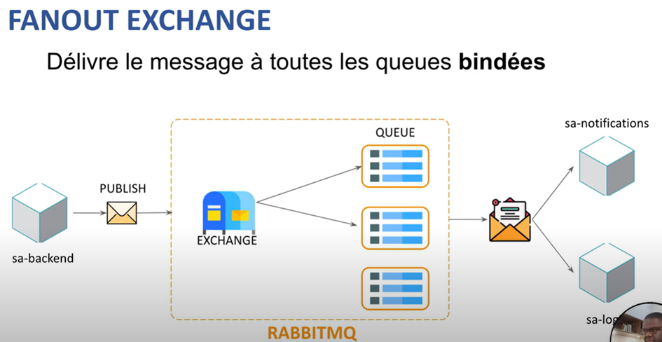
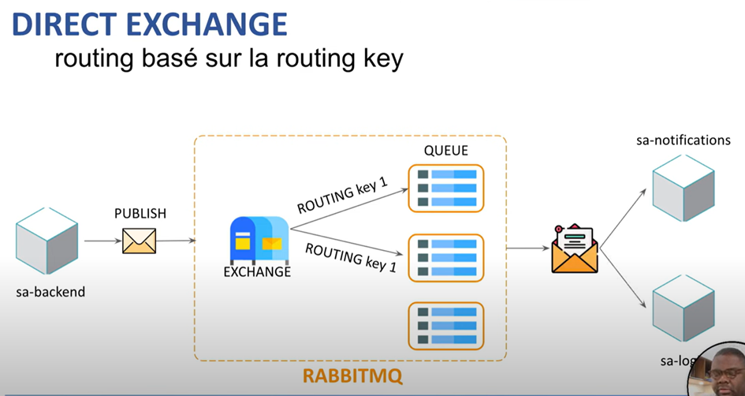
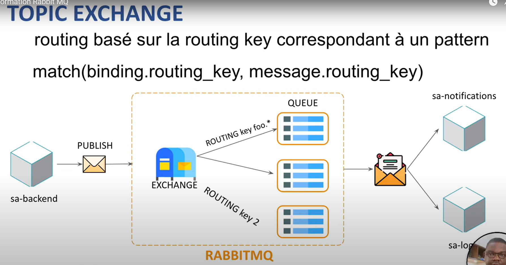
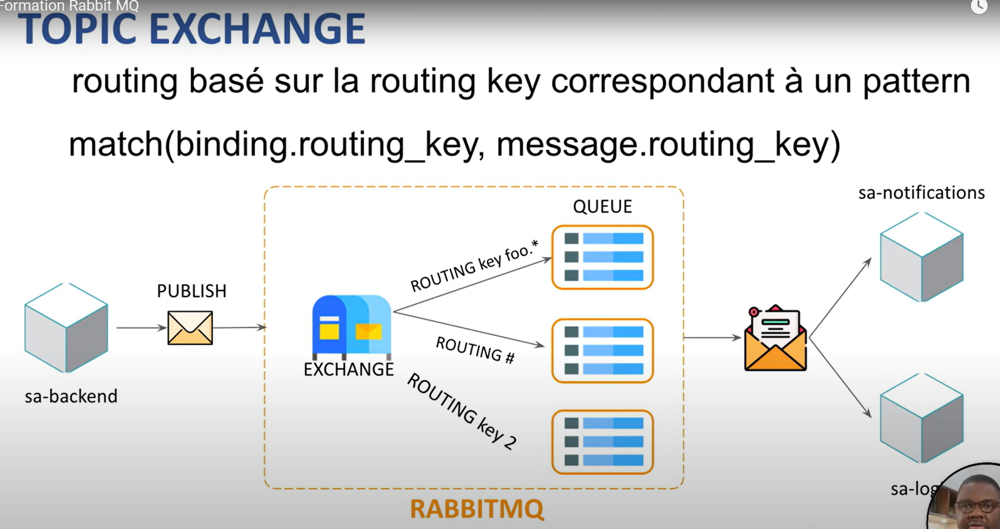
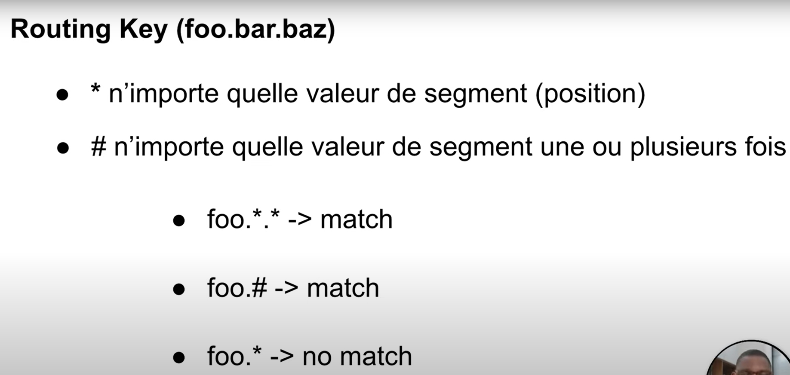
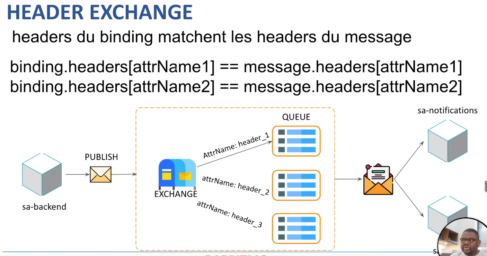

# Qu'est-ce que RabbitMQ® ?
RabbitMQ est un logiciel open source, développé par Pivotal Software, Inc. Il s'agit d'un message broker (bus/agent de messages), très simple à mettre en place, multi-plateforme et multi-protocole (AMQP, MQTT, STOMP).

RabbitMQ est donc particulièrement adapté pour monter rapidement une architecture microservices ou IoT, nécessitant un bus de message pour garantir les communications entre les différentes briques de cette architecture.

## Fanout exchange ==> sorte de broadcast
(git --> 01-exchange-fanout, main)

## Direct exchange
(git --> 02-exchange-direct, main)

En fonction de la routing, RabbitMQ redirige le message dans une liste (queue).

Ensuite, les applications abonnées aux listes en question pourront récupérer le message.

Par rapport au fanout, on restreint la redirection grâce aux routings.

## Topic exchange
Le topic est un routing un peu plus flexible.

Filtres : * et #

### Exemples du fonctionnement du filtre

## Header exchange
Le binding est réalisé par les attributs de l'entête.

# Notes en vrac (Draft)

## Compte
Compte est émetter de messages (au niveau de RabbitMQ).

## CRM
CRM est récepteur de messages (au niveau de RabbitMQ).

## Notification
Compte est récepteur de messages (au niveau de RabbitMQ).

## Lancer RabittMq
* http://localhost:15672/#/queues
* username : guest
* password : guest

## Tests
* cf PostMan : "RabbitMQ Tests"

## Lancement du projet
* Lancer docker
* puis lancer cette commande : docker start 279ca1ed313e
* puis lancer CompterApplication
* puis lancer NotificationApplication
* puis lancer CrmApplication
* puis lancer la requête POST (PostMan), et vérifier le résultat attendu sur RabbitMQ

